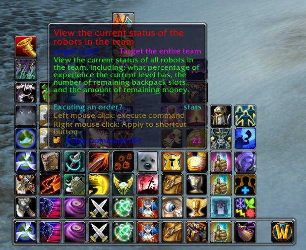

## UnBot for AzerothCore Module

This addon is for use with azerothcore-wotlk version with the playerbots. (AzerothCore Modules Page)

https://github.com/liyunfan1223/azerothcore-wotlk/tree/Playerbot

///////////////////////////////////////

**I am working on translating this addon to English for a small project, however, I dont speak or read chinese.**

//////////////////////////////////////

A robot control plug-in modified based on the UnBot plug-in. As a supporting plug-in for the AzerothCore robot module, it is convenient for players to control robots.

**As of now, this no longer supports Chinese Clients.**

Installation method: Place UnBot and YssBossLoot in the Interface/AddOns/ directory

**The control / menu bar**

**Plug-in interface display:**

**Add a specified Bot:**

The original mangosbots addon doesn't work with the AzerothCore Module version of the player bots. Seems some commands are missing or 
maybe just were not added. This addon has some quirks and i've not fixed anything at this point, I simply translated what I could.

